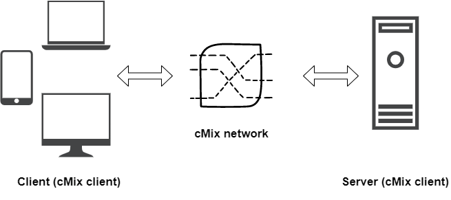

# Getting Started

:::note
This document uses the term “cMix client” to mean a unique user in the cMix network. The terms “client” and “server” will distinguish cMix clients based on their roles in a client-server architecture. They are also used interchangeably with “connect client” and “connect server,” respectively.
:::

To integrate cMix with your application logic, each instance needs to be connected to the xx cMix network. This begins with creating a new cMix client and registering its identity with the network. Session data is stored in an encrypted key-value (EKV) store containing cryptographic keys and state.

While there are multiple use cases for communicating over cMix, this document focuses on communicating with a specific recipient, such as a server. It outlines the steps for setting up two simple applications structured in a client-server architecture, where each application is also a cMix client. 


*The client and server applications are both cMix clients, interfacing with the cMix network using the Client API.*

The client and server applications are both cMix clients, interfacing with the cMix network using the Client API.

The complete source code for the sample client and server applications is [available on GitLab](https://git.xx.network/elixxir/xxdk-examples). You can also browse the [API Reference](https://pkg.go.dev/gitlab.com/elixxir/client/xxdk) for comprehensive detail on the different types and functions exposed by the cMix Client API (xxDK).

## Objectives of This Guide

This guide covers the entire process of integrating the xxDK in an application, registering within the xxDK and setting up a connection with the cMix network, setting up listeners, as well as sending and receiving messages or other data. It aims to help you accomplish the following:

- Create two cMix clients set up in a client-server architecture
- Set up the client application to exchange messages with a server
- Set up the server to listen for and respond to messages from the client application(s)

We include a sample scenario in [*Putting It All Together*](#putting-it-all-together-sample-scenario) to create a picture of how the client and server might interact with each other.

## Setting Up a cMix Client

This section briefly discusses commonalities between client and server applications—steps that any cMix client needs to be set up correctly.  They include:

1. Fetching an NDF
2. Creating and initializing a cMix object
3. Creating a reception identity
4. Starting network threads

The steps diverge after creating a reception identity. Depending on whether you are building a server or client,  the network threads will be started slightly differently and not necessarily in the order listed above.

Once the most basic steps are completed, a cMix client acting as a ‘server’ starts up a server to listen for connections from clients while each client attempts to connect to the server securely. This is all handled with the `connect` package:

```swift
"gitlab.com/elixxir/client/connect"
```

Skip over to [*Setting Up a Connect Server*](#setting-up-a-connect-server) to browse server-specific steps and [*Setting Up a Connect Client*](#setting-up-a-connect-client) for steps specific to a client application. 

### Import the xxDK

The xxDK is a Go library that can be imported like any other Go package.

```go
"gitlab.com/elixxir/client/xxdk"
```

You will need to import a few more packages along the way. However, we will include them as needed to avoid unused import warnings from the compiler. It is straightforward to switch out the external libraries for any alternatives you prefer.

:::tip
To ensure you are using the latest release version of the client, you can run `go get gitlab.com/elixxir/client@release`. This will update your `go.mod` file automatically.
:::

### Fetching the NDF

The NDF, or network definition file, is a signed file with a [predefined structure](https://xxnetwork.wiki/Network_Definition_File_(NDF)) containing the current network state and configuration for a target network.  For deployed applications, the NDF should be queried from one or a few trusted network gateways. See [NDF Retrieval](./guides/ndf-retrieval)  for recommendations on how to retrieve an NDF and establish trust with one or more gateways.

### Create a Client Keystore

The (cMix) client keystore is a directory-backed storage which contains the cryptographic keys and state data. On initialization, it creates a set of keys for outbound communication with the xx network.

:::caution

It is vital that the contents of the Client Keystore are stored securely. See *[cMix Client Keystore](https://www.notion.so/cMix-Client-Keystore-1fc63d2a52e946debc70991144f4fb0a)* for  the cryptographic details of the storage and recommendations for storing the generated keys on different platforms.
:::

The keystore is created on disk by calling the `NewCmix()` function.

```go
func NewCmix(ndfJSON string, storageDir string, password []byte, registrationCode string) error
```

`NewCmix()` expects multiple arguments:

- `ndfJSON`: This is string-formatted NDF data.
- `storageDir`: The path to the directory that will store the state for the cMix client. It is a `string` type.
- `password`: User-specified password for accessing cMix client sessions. Must be passed in as a byte slice (`[]byte`).
- `registrationCode`: Optional argument. Enables pre-selected users to register a code with the registration server. Use an empty string to register without a code.

### Load the Client Keystore

Next, load the client keystore you just created using the `LoadCmix()` function.

```go
func LoadCmix(storageDir string, password []byte, parameters xxdk.Params) (*xxdk.Cmix, error)
```

`LoadCmix()` expects the same `storageDir` and `password` used to call `NewCmix()`. It also expects some network parameters. You can fetch the default parameters using `xxdk.GetDefaultCmixParams()`, which can then be modified and passed into `LoadCmix()` as needed.

```go
// Load with the same storageDir and password used to call NewCmix()
net, err := xxdk.LoadCmix(storageDir, []byte(password),
	xxdk.GetDefaultCMixParams())
if err != nil {
	// Handle failed to load state error
}
```

This call starts communication with the network and registers your client with the [permissioning server](https://xxdk-dev.xx.network/technical-glossary#permissioning-server). This enables you to keep track of the network state for message sending and retrieval.

### Creating Reception Identities

A cMix client must generate a cryptographic identity for receiving messages. This is typically referred to as its *Reception Identity*. Reception Identities are your designation or name on the network—what other parties know you as.

A new Reception Identity can be created by passing a `Cmix` object to `MakeReceptionIdentity()`.  You can reuse a Reception Identity or create an infinite number of Reception Identities on the fly, but there is a privacy tradeoff between having established identities and frequently creating new identities.

The Reception Identity has keying material in it, so it is crucial that it is stored in an encrypted location. `StoreReceptionIdentity()` handles this automatically, which is the recommended way to store identities. This way, a user only has to save the lookup key, which can be stored arbitrarily.  Similarly, a saved identity can be retrieved from the Client Keystore using `LoadReceptionIdentity()`.
<details>

<summary>Code sample</summary>

```mdx-code-block
import CodeBlock from '@theme/CodeBlock';

<CodeBlock className="language-go" showLineNumbers>
  {
	`// Sample key for storing reception identity object
identityStorageKey := "identityStorageKey"
	
// If no extant xxdk.ReceptionIdentity, generate and store a new one
identity, err := xxdk.LoadReceptionIdentity(identityStorageKey, net)
if err != nil {
	identity, err = xxdk.MakeReceptionIdentity(net)
if err != nil {
	// Handle failed to generate reception identity error
}
err = xxdk.StoreReceptionIdentity(identityStorageKey, identity, net)
if err != nil {
	// Handle failed to store new reception identity error
}
`}
</CodeBlock>
```
<p>Note that the identity storage key is simply a dictionary lookup key used to access a stored identity.</p>
</details>

#### Writing Contacts to File

In order to contact another cMix client directly, you must obtain a contact file based on the Reception Identity belonging to the desired recipient. 

```go
import (
	"gitlab.com/xx_network/primitives/utils"
)

// Set the output contact file path
contactFilePath := "connectServer.xxc"

// Save the contact file so that clients can connect to this server
err := utils.WriteFileDef(outfilePath, identity.GetContact().Marshal())
```

Note that the file extension can be chosen arbitrarily, although we stick to `.xxc` and `.json`.

### Starting Network Threads

The network follower is a relatively computationally-intensive thread that keeps track of network state and health. The client is able to operate fully only once the network is in a healthy state, as indicated by the follower seeing rounds completed successfully.

```go
func (* Cmix) StartNetworkFollower(timeout time.Duration) error
```

`StartNetworkFollower()` takes a single timeout duration that specifies how long to wait for the function call to succeed before a timeout error is returned. To stop the network threads, such as when your application is closed or put in the background, simply run  `StopNetworkFollower()`.

<details>
<summary>Code sample</summary>
<div>
<p>For our application, we have also set up a function that starts network threads and waits until the network is healthy before proceeding.</p>

```mdx-code-block
<CodeBlock className="language-go" showLineNumbers>
  {
	`// Set networkFollowerTimeout to a value of your choice (seconds)
networkFollowerTimeout := 5 * time.Second
    
err = connectServer.User.StartNetworkFollower(networkFollowerTimeout)
if err != nil {
	// Handle failed to start network follower error
}
    
// Create a tracker channel to be notified of network changes
connected := make(chan bool, 10)
    
// Provide a callback that will be signalled when network health
// status changes
connectServer.User.GetCmix().AddHealthCallback(
	func(isConnected bool) {
		connected <- isConnected
	})
    
// You may implement a function which retries
// attempts to connect to the network
waitUntilConnected := func(connected chan bool) {
	// ...
}
    
// Wait until connected or crash on timeout
waitUntilConnected(connected)
`}
</CodeBlock>
```
</div>
</details>

## Building Client/Server Relationships using Connections

The `connect` package provides a quick and convenient way of establishing client/server relationships over cMix. Initially, a client requires the server’s contact file in order to make a connection. The connection process functionally establishes a cryptographic relationship between the two that is encapsulated by a `connect.Connection` object. Using this object, end-to-end encrypted messages can be sent between client and server with ease and handled with customized business logic as defined by your application.

## Setting Up a Connect Server

Creating a server capable of interacting with clients is a very straightforward process using connections. Almost all the code required is standard, with business logic relevant to your specific implementation needs is handled entirely in two places—message listeners and the connection callbacks. Pay special attention to these sections when writing a server application.

### Enabling Message Reception

A message listener is the only way to handle incoming end-to-end encrypted messages. They are a piece of code that is registered with the xxDK to be run whenever an E2E message is received. Message listeners can be further filtered to handle specific message types or specific message senders depending on application needs.

We will soon create a message listener using the `RegisterListener()` method on the `Connection` object:

```go
func (c *connect.Connection) RegisterListener(messageType catalog.MessageType,
	newListener receive.Listener) (receive.ListenerID, error)
```

`RegisterListener()` expects the following arguments:

- `messageType`: Use `catalog.NoType` (`"[gitlab.com/elixxir/client/catalog](http://gitlab.com/elixxir/client/catalog)"`) as a wildcard to listen to all existing types of messages.
- `newListener`: An implementation of the `Listener` interface (shown below).

```go
// Listener interface for a listener adhere to
type Listener interface {
	// The Hear function is called to exercise the listener, passing in the
	// data as an item
	Hear(item Message)
	// Returns a name, used for debugging
	Name() string
}
```

When a message matching the registered listener is received, the `Hear()` function will receive a copy of the message to handle with user-specified logic. The code example below shows a very simple `Listener` that simply prints out received messages and sends an automated response in return.

<details>
<summary>Code sample</summary>
<div>
<CodeBlock className="language-go" showLineNumbers>
  {
	`// listener.go
    
// ...
      
import (
	jww "github.com/spf13/jwalterweatherman"
	"gitlab.com/elixxir/client/connect"
	"gitlab.com/elixxir/client/e2e/receive"
	"gitlab.com/elixxir/client/catalog"
	"gitlab.com/elixxir/client/xxdk"
)
    
// listener adheres to the receive.Listener interface.
type listener struct {
	name string
	connection connect.Connection
}
    
// Hear will be called whenever a message matching the RegisterListener call is
// received; User-defined message handling logic goes here.
func (l *listener) Hear(item receive.Message) {
	jww.INFO.Printf("Message received: %v", item)
    
	// Acknowledge connection by sending a response
	respond(l.connection)
}
    
// Name is used for debugging purposes.
func (l *listener) Name() string {
	return l.name
}
    
func respond(connection connect.Connection) {
	msgBody := "Hi, I'm the server, and you just connected to me."
    
	roundIDs, messageID, timeSent, err := connection.SendE2E(catalog.XxMessage, []byte(msgBody), xxdk.GetDefaultE2EParams().Base)
	if err != nil {
		// Handle failed to send message error
	}
	jww.INFO.Printf("Message %v sent in RoundIDs: %+v at %v", messageID, roundIDs, timeSent)
}
`}
</CodeBlock>
</div>
</details>

### Enabling Incoming Connections

The connection callback is defined within the system as the custom logic that will be executed whenever a client attempts to open a new `connect.Connection` with the running server. To this end, the connection callback will eventually be passed as an argument into `connect.StartServer()`.

The following code sample demonstrates what a callback for handling incoming client connections might look like. Notably, this incorporates the creation of a message listener as described in the previous section in order to facilitate future message reception once the connection is established:

```go
import "gitlab.com/elixxir/client/catalog"

// Create callback for incoming connections
connectionCallback := func(connection connect.Connection) {
// User-defined behavior for message reception goes in the listener
	_, err = connection.RegisterListener(
 		catalog.NoType, &listener{"connection server listener", connection})
	if err != nil {
		// Handle failed to register listener error
	}
}
```

### Start the Server

Once the connection callback has been defined, the connection server may be started using `connect.StartServer()`:

```go
func StartServer(identity xxdk.ReceptionIdentity, connectionCallback Callback,
  net *xxdk.Cmix, params xxdk.E2EParams, clParams ConnectionListParams)
  (*ConnectionServer, error)
```

`StartServer()` assembles a `Connection` object on the server-side and feeds it into the given `Callback` whenever an incoming request for an end-to-end (E2E) partnership with a client completes successfully. It expects the following arguments:

- `identity`: This is the reception identity of the cMix client, created in [*Creating Reception Identities.*](#creating-reception-identities).
- `connectionCallback`: The callback that will handle incoming client connections.
- `net`: This is the cMix object created in [*Create a Client Keystore*](#create-a-client-keystore)
- `params`: Network parameters for sending E2E messages over the cMix network. Includes authentication and rekey parameters amongst others. Use `xxdk.GetDefaultE2EParams()` for the default settings.
- `clParams`:  Parameters that determine the frequency of stale connection cleanups. Use `connect.DefaultConnectionListParams()` for the default settings.

<details>
<summary>Code sample</summary>
<div>

<CodeBlock className="language-go" showLineNumbers>
  {
	`import "gitlab.com/elixxir/client/connect"
    
// Start the connection server, which will allow clients to start connections with you
e2eParams := xxdk.GetDefaultE2EParams()
connectionListParams := connect.DefaultConnectionListParams()
    
connectServer, err := connect.StartServer(
	identity, connectionCallback, net, e2eParams, connectionListParams)
if err != nil {
	// Handle unable to start connection server error
}
`}
</CodeBlock>
</div>
</details>  

Now, you can create a client and attempt to connect with the running server.

## Setting Up a Connect Client

Similar to the server, almost all the code required for a connect-backed client is standard. The business logic relevant to your specific implementation needs is handled entirely within your own sending logic as well as in the message reception listener.

### Create the E2E User Object

`Login()` bundles a `ReceptionIdentity` and `Cmix` into an `E2e`, which is required for establishing a client-side `Connection`. This operation ultimately forms the representation of the user of the client’s network identity and allows for end-to-end encrypted operations. While the `E2e` object is assembled under the hood server-side, we must do this explicitly on the client-side.

```go
func Login(net *Cmix, callbacks AuthCallbacks, identity ReceptionIdentity,
  params E2EParams) (m *E2e, err error)
```

`Login()` expects the following arguments:

1. `net`: This is the cMix object created in [*Create a Client Keystore*](#create-a-client-keystore) 
2. `callbacks`: These are the callbacks for handling E2E relationship operations between cMix clients. The `connect` package will handle these independently, thus one can simply feed in the same struct (`xxdk.DefaultAuthCallbacks{}`) shown in the sample code below which provides basic implementations of these callbacks.
3. `identity`: This is the same identity created in [*Creating Reception Identities.*](#creating-reception-identities)
4. `params`: These are network parameters for sending E2E messages over the cMix network. Use `xxdk.GetDefaultE2EParams()` for the default settings.

```go
user, err := xxdk.Login(net, xxdk.DefaultAuthCallbacks{}, identity, xxdk.GetDefaultE2EParams())
if err != nil {
	panic("unable to login")
}
```

### Connect To the Server

The simplest way for connecting a client and a server is through the use of a contact file, as described earlier in [*Writing Contacts to File*](#writing-contacts-to-file). While there are several options for finding and establishing relationships with clients across cMix, contact files work especially well in this example because the identity of a server is not expected to change.

Use `Connect()`, which is located in the `connect` package (`"gitlab.com/elixxir/client/connect"` ), to negotiate the connection. You will need to provide the server’s contact file as well as the `E2e` object created by `Login()` in the previous step.

```go
func Connect(recipient contact.Contact, user *xxdk.E2e, p xxdk.E2EParams)
  (connect.Connection, error)
```

`Connect()` performs key negotiation with a given recipient and returns a `Connection` object, which will later be used to register a listener and send messages. An example of reading in a contact file in order to open a connection is provided below.

<details>
<summary>Code sample</summary>
<div>

<CodeBlock className="language-go" showLineNumbers>
  {
	`// Path to the server contact file
serverContactPath := "../connectServer/connectServer.xxc"
    
// Read the server's contact data
contactData, err := ioutil.ReadFile(serverContactPath)
if err != nil {
	// Handle failed to read server contact file error
}
    
// Import "gitlab.com/elixxir/crypto/contact" which provides
// an \`Unmarshal\` function to convert the byte slice output
// of \`ioutil.ReadFile()\`to the \`Contact\` type expected by \`Connect()\`
recipientContact, err := contact.Unmarshal(contactData)
if err != nil {
	// Handle failed to get contact data error
}
    
// Create the connection
handler, err := connect.Connect(recipientContact, user, params)
if err != nil {
	// Handle failed to create connection object error
}
`}
</CodeBlock>
</div>
</details>  

### Enabling Message Reception

Message reception support is added client-side much the same as the server-side.

```go
import "gitlab.com/elixxir/client/catalog"

// Listen for all types of messages using catalog.NoType
// User-defined behavior for message reception goes in the listener
_, err = handler.RegisterListener(catalog.NoType, listener{
	name: "e2e Message Listener",
})
if err != nil {
	// Handle could not register message listener error
}
```

You will also want to implement the `Listener` interface just as we did for the server. All response logic is handled by the `Hear()` function.

<details>
<summary>Code sample</summary>
<div>

<CodeBlock className="language-go" showLineNumbers>
  {
	`// listener.go
    
package main
    
import (
	jww "github.com/spf13/jwalterweatherman"
    
	"gitlab.com/elixxir/client/e2e/receive"
)
    
// listener implements the receive.Listener interface
type listener struct {
	name string
}
    
// Hear will be called whenever a message matching
// the RegisterListener call is received
// User-defined message handling logic goes here
func (l listener) Hear(item receive.Message) {
	jww.INFO.Printf("Message received: %v", item)
}
    
// Name is used for debugging purposes
func (l listener) Name() string {
	return l.name
}
`}
</CodeBlock>
</div>
</details>

### Sending Messages to the Server

With the connection to the server established and message reception enabled, the client is now ready to begin communicating with the server. This will be done using methods of the `connect.Connection` object returned by `Connect()` in the previous steps.

```go
func (connect.Connection).SendE2E(mt catalog.MessageType, payload []byte,
  params e2e.Params) ([]id.Round, e2e.MessageID, time.Time, error)
```

It expects the following arguments:

- `mt`: This is the message type. Specify as `catalog.XxMessage`.
- `payload`: The actual message contents. Pass in the payload as a byte slice.
- `params`: Network parameters for sending E2E messages over the cMix network. Use `xxdk.GetDefaultE2EParams().Base` for the default settings.

 `SendE2E()` returns the list of rounds in which parts of your message were sent, the message ID, and the sent timestamp. An error is returned if the send is unsuccessful.

<details>
<summary>Code sample</summary>

<CodeBlock className="language-go" showLineNumbers>
  {
	`// Test message
msgBody := "If this message is sent successfully, we'll have established contact with the server."
    
params := xxdk.GetDefaultE2EParams() // defined earlier
    
roundIDs, messageID, timeSent, err := handler.SendE2E(catalog.XxMessage, []byte(msgBody), params.Base)
if err != nil {
	// Handle failed to send message error
}
jww.INFO.Printf("Message %v sent in RoundIDs: %+v at %v", messageID, roundIDs, timeSent)
`}
</CodeBlock>

<div>
</div>
</details> 

## Putting It All Together: Sample Scenario

Suppose you have a server hooked up to a fax machine. When a client sends something to the server, the server takes that data and sends it as a fax.

As the server, you create a cMix client and set it up with a reception identity. You generate your contact file and call `connect.StartServer()`, which is passed a `Callback`, to start listening for connections.

You distribute your contact file to your users, so they can use it to contact you like a phone number.

Users call `connect.Connect()`, which establishes a relationship with the server.

The server sees one of these connections—a user wants to send a fax, so they opened a connection. It assembles a `Connection` object and feeds it into the `Callback` passed to `StartServer()`.

Next, the server calls `RegisterListener()` to start listening for messages coming in from that connection with a client. 

When the listener picks up a fax sent to it as a message, it reads it and sends the fax onward to its intended destination.

Assuming that hundreds of users are doing this all at the same time, each with their own `Connection`, you’ll want to catalogue all connections somehow in the `Callback` passed to `StartServer()`. Then you can look up what `Connection` corresponds to each user and let them know that you successfully sent their fax by sending a message with `connection.SendE2e()`.

On a high level, integrating the Client API with your application can be reduced to:

1. Generate an identity for your client to identity itself on the network.
2. Interact with the network by starting network followers.
3. Register listeners for message reception.
4. Send and receive encrypted messages.

For best results, ensure that you perform these actions in the given order.